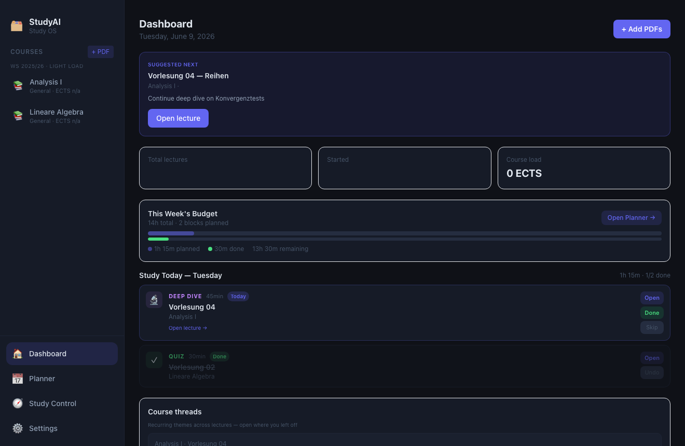

# StudyAI

Local-first AI study operating system for university students. Turn lecture PDFs into structured, teachable learning surfaces — summaries, deep dives, quizzes, exercises, and a weekly planner — with everything stored in a local vault on your machine.

## Screenshot

### Dashboard — suggested next step, weekly budget, and today's blocks

The home dashboard shows what to study next, weekly time budget, today's planner blocks, course threads, and quick access to continue items across all courses.



## What it does

### Course & PDF intake
- **Courses** — semester containers with ECTS, priority, status, and module grouping
- **PDF intake** — drag & drop, batch import, multi-select file picker
- **Lecture structure v5** — stable topic tree, prerequisites, and course threads from raw PDFs

### Learning surfaces
- **Overview** — focus theme, core themes, topic tree, prerequisites
- **Summary / Concepts** — distinct roles; German lectures stay German
- **Deep Dive** — per-topic modes: Verstehen, Beispiel, Prüfungsfalle, Kursbezug
- **Study path** — ordered units per lecture (understand → example → practice)
- **Interactive Quiz** — in-app MCQ with feedback (lecture-wide + per deep dive)
- **Aufgaben** — lecture-grounded exercises with hints, solutions, and progress tracking
- **My note space + study card** — private notes; AI builds a study card from *your* notes

### Planning
- **Dashboard** — suggested next action, continue items, course health
- **Weekly planner** — time budget, day blocks, done/skip/open flows
- **Study Control** — course-level overview and sequencing

## Tech stack

| Layer | Technology |
|-------|------------|
| Desktop shell | Electron |
| Frontend | React, Vite, Tailwind CSS |
| PDF processing | pdf-parse |
| Math rendering | KaTeX, react-markdown |
| AI | OpenAI API (generation only) |
| Storage | Local vault (per course/lecture) + electron-store |

## Requirements

- Node.js 18+
- macOS (primary target)
- OpenAI API key (generation only — vault and UI are fully local)

## Run locally

```bash
npm install
npm run dev
```

Vite serves the renderer on port 5173; Electron opens automatically.

## Build desktop app

```bash
npm run build:renderer
npm run build
```

Packaged output: `dist-app/mac-arm64/StudyAI.app`

## Vault layout

```
{vaultPath}/{CourseName}/{LectureName}/
  original.pdf
  extracted.txt
  summary.md
  concepts.md
  overview.md
  quiz.md
  aufgaben.json
  aufgaben.md
  aufgaben_progress.json
  notes.md
  meta.json
  lecture_structure.json
  interactive_quiz.json
  deep_dives/
```

Configure vault path and API key in **Settings** on first launch.

## Related projects

Pairs naturally with [Course Dashboard](https://github.com/zayzyyazy/course-dashboard) (structured course navigation) and [Exam Practice Coach](https://github.com/zayzyyazy/exam-practice-coach) (adaptive exam prep).

## Author

**[zayzyyazy](https://github.com/zayzyyazy)**
